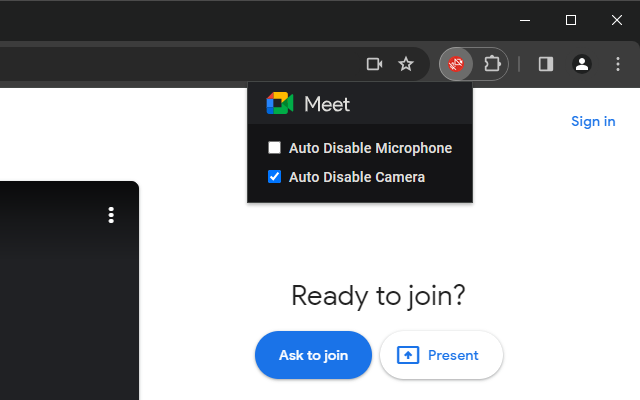

## Description 

This simple extension provides options to default your microphone and camera to disabled. It also displays emojis in the tab title
indicating if your microphone is muted or your camera is on.

## Screenshots

